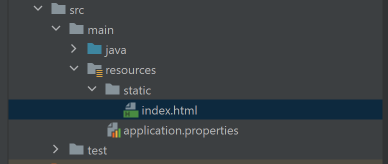
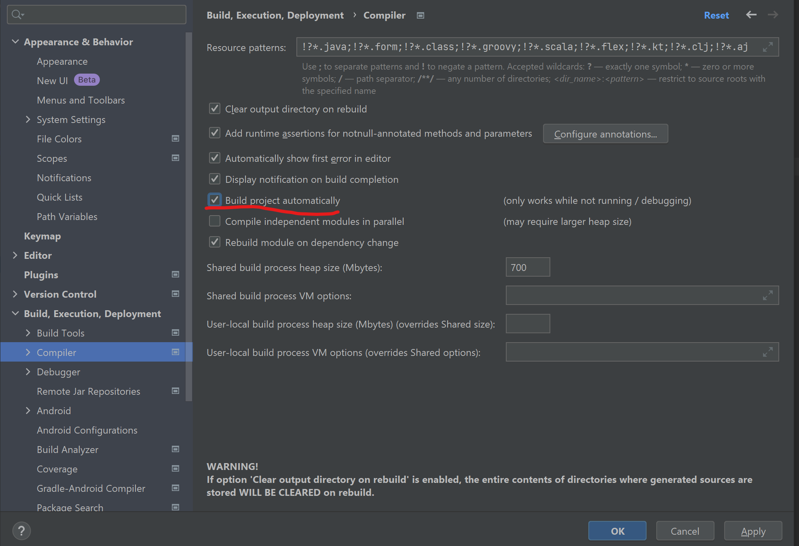
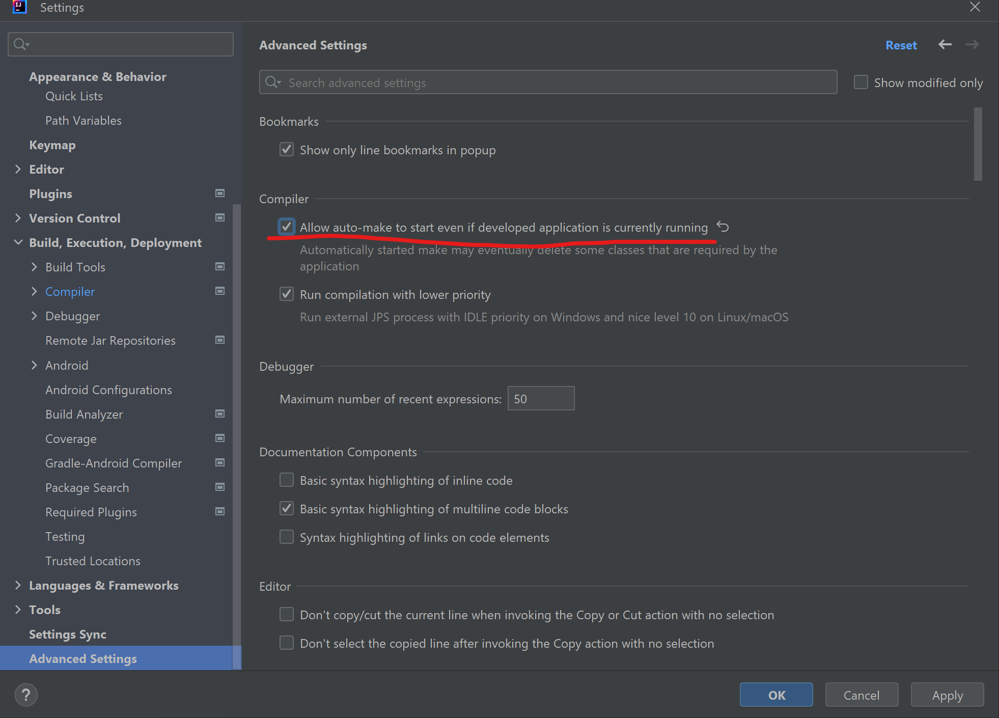

# SPRING BOOT
## Static files
Any files that need to be publicly accesible, needs to be located under static folder

## Configure Running Port
You must put the code below into _application.properties_ file.

    server.port=9090

So that your application will run on port 9090.

## spring-boot-devtools (dependency)
It pick up new changes and restart. There are two configs on Intellij idea.

